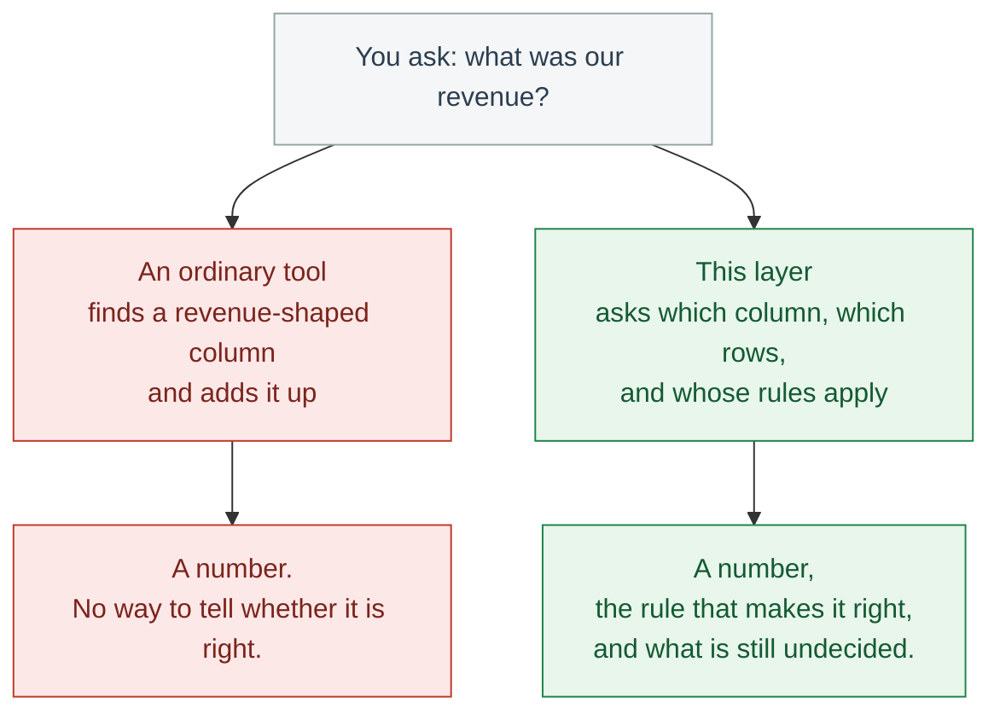
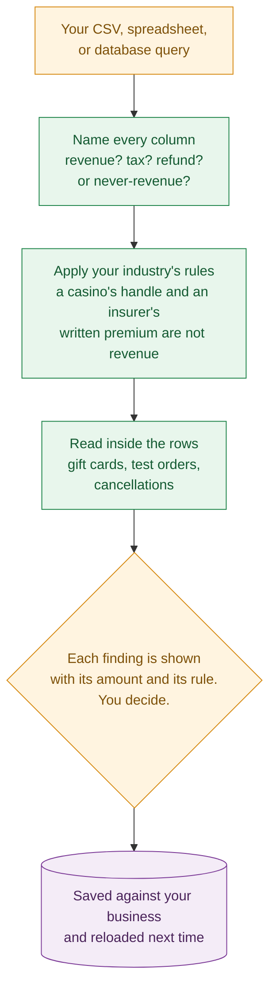
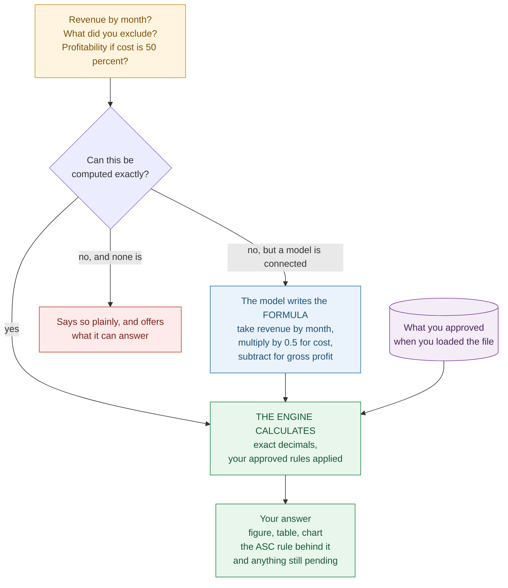

# Akshapatalika AI

**An accounting layer for your data. Because not every number is revenue.**

Point it at a CSV, a spreadsheet, or a database query. It reads the columns the way
an accountant would, tells you which ones are revenue and which only look like it,
and answers questions in plain English — with the ASC paragraph behind every figure.

---

## Why this layer has to exist

Arithmetic is easy. `SUM(amount)` is easy. Every tool you already own can do it, and
a language model will do it instantly and confidently.

**The hard part was never the maths. It is knowing what the numbers mean.**

A casino's `coin_in` column is not revenue. An insurer's `written_premium` is not
revenue. A film studio's `ultimate_revenue` is not revenue — it is the *denominator
of a forecast*. A franchisor's `system_wide_sales` belongs to the franchisees. A
lender's `origination_volume` is a volume metric. Sales tax is money you are holding
for the government. A gift card is a debt you owe in goods.

Every one of those columns is a number. Every one of them sums cleanly. Every one of
them produces a plausible answer that is wrong — sometimes by twenty times — and
nothing about the output says so.

```
Ask a general-purpose tool:  "what was our revenue?"
It writes:                   SELECT SUM(coin_in) FROM gaming   →  48,000,000
The correct answer:                                               2,090,000
```

That is a **23× overstatement**, produced by syntactically perfect code, from a
correctly-named column, with no error anywhere. This is not a hallucination problem
that better models fix. It is a *semantics* problem: the tool knew how to add, and
did not know what it was adding.

This layer supplies the missing half. It carries the accounting meaning of columns,
rows, and industries — so that when the arithmetic happens, it happens on the right
numbers, and the answer arrives with the rule that made it right.



> **The design rule throughout: a confident wrong number is worse than no number.**
> It is unreviewable, and it reads exactly like a correct one. So when this system
> cannot answer something properly, it says so.

---

## Start here: what it finds in an ordinary file

A real eCommerce export — 57 orders, 81 rows, nothing unusual. Its `Total` column sums
to **32,204.06**. Reported revenue under US GAAP is **29,723.47**. In between:

| Finding | Amount | Why it is not revenue |
|---|---:|---|
| Sales tax collected | 1,961.54 | Held for the tax authority; a liability, not income — ASC 606-10-32-2A |
| Gift cards sold | 500.00 | You owe goods. A contract liability until redeemed — ASC 606-10-45-1 |
| Test line items | 92.00 | Not a contract with a customer at all — ASC 606-10-25-1 |
| Refunds given | 2,557.23 | Reduces the transaction price — ASC 606-10-32-2 |
| Shipping charged | 51.91 | Revenue, but a separate obligation — presented on its own line |

It also catches two things about the file itself:

- `Subtotal + Taxes + Shipping` = 32,328.92 against a `Total` of 32,204.06. **The
  export does not foot**, by 124.86.
- `Fulfilled at` is populated in **1 row out of 81**, so delivery date cannot be used
  to decide which period a sale belongs to — however much the accounting would
  prefer it (ASC 606-10-25-23).

None of this is adjusted without your approval. Each item is presented with its
amount, the lines it affects, and the rule, and you decide.

---

## The hard cases: where general-purpose tools break

These are drawn from the twenty specialized industry regimes in the reference pack.
In each, a correctly-named column produces a badly wrong answer.

### Casinos — ASC 924

`handle`, `drop` and `coin_in` are **amounts wagered**, not revenue. The same dollar
is bet, won, and bet again all night.

| | |
|---|---:|
| `coin_in` (total wagered) | 48,000,000 |
| less payouts to players | (45,600,000) |
| **Gross gaming revenue** | **2,400,000** |
| less promotional allowances (comps) | (310,000) |
| **Net win — the revenue figure** | **2,090,000** |

Two further traps the pack documents: **chips outstanding are a liability**, not
revenue, until played or retired; and **base jackpots** accrue on whether the payout
is *avoidable*, not on whether it is probable.

*The system forbids `handle`, `drop`, `coin_in` and `wagered` from any revenue
aggregation outright — they are removed from the expression, not merely warned about.*

### Insurance — ASC 944

`written_premium` is what you billed. **Earned premium** is what you have delivered
coverage for. Write 12,000,000 of annual policies evenly through the year and only
about half is revenue; the rest is an unearned premium reserve — a liability.

Summing `written_premium` roughly **doubles** revenue. Ceded reinsurance is presented
separately and does not reduce written premium. Short-duration and long-duration
contracts recognise on different bases entirely.

### Film and television — ASC 926

`ultimate_revenue` is the single most dangerous column in this list, because the name
is honest and the meaning is not. It is the **estimated total revenue over a film's
life** — the *denominator* used to amortise capitalised film cost:

```
period amortisation = unamortised film cost × (current period revenue ÷ remaining ultimate revenue)
```

Sum it as revenue and you report a forecast of a decade as this year's income.

The pack documents the surrounding traps: amortisation must use the
individual-film-forecast method, not a straight line, because film revenue is
front-loaded; after revising the estimate, the denominator becomes **remaining**
ultimate revenue at the beginning of the year of change — reusing the original figure
double-counts revenue already earned; and impairment write-offs are **never restored**.

### Franchisors — ASC 952

`system_wide_sales` is what the *franchisees* sold. It is not the franchisor's
revenue and never was.

| | |
|---|---:|
| Franchisee system-wide sales | 85,000,000 |
| Franchisor revenue: royalties at 5% | 4,250,000 |
| plus initial franchise fees earned | 380,000 |
| **Franchisor revenue** | **4,630,000** |

An **18× overstatement** if summed naively. The pack also flags the outdated
"substantial performance" model — franchise fees are an ASC 606 allocation question
now — and warns against recognising a full initial fee on opening day without
allocating across licence, training, pre-opening services and equipment.

### Not-for-profit — ASC 958

The distinction that general models get wrong more than any other:

| Situation | Treatment |
|---|---|
| $500,000 pledge, **conditional** on raising matching funds not yet raised | **Not revenue.** A barrier exists and the right of return has not lapsed — ASC 958-605-25-5A † |
| $500,000 gift **restricted** to constructing a building | **Revenue now**, classified *with donor restrictions* — ASC 958-210-45-2 † |
| $500,000 received to pass to a named beneficiary | **Not revenue.** An agency transaction — a liability — ASC 958-20-25-1 † |

**A restriction affects classification. A condition affects timing.** They are
routinely conflated, and the error moves revenue between years.

† These paragraph numbers are marked *unverified* in the citation catalog: the
requirement is right, the numbering is unconfirmed against the published
Codification. They render with an `UNVERIFIED` marker in the app.

### Mortgage banking — ASC 948

`origination_volume` of 240,000,000 is a volume metric. Revenue is the **gain on sale
of loans plus servicing fees** — perhaps 3,600,000 against that volume. A **66×**
error.

### Oil and gas — ASC 932

Gross wellhead value is before the royalty owners' share. Revenue is at **net revenue
interest**:

| | |
|---|---:|
| Gross wellhead value | 10,000,000 |
| less royalty interest (18.75%) | (1,875,000) |
| working interest share (60%) | |
| **Revenue at net revenue interest** | **4,875,000** |

The pack also separates upstream from downstream and from royalty interests.

### Software — ASC 985 and 606

`ARR`, `TCV` and `bookings` are commercial metrics with no GAAP standing. A 1,200,000
three-year contract is not 1,200,000 of revenue. Licence, post-contract support and
services are separate performance obligations recognised on different patterns, and
internal-use software is scoped out of the software-to-be-sold guidance entirely
(ASC 350-40-15-2 †).

### And the rest

| Industry | Looks like revenue | Actually is |
|---|---|---|
| Broadcasters (920) | gross billings | net of agency commission; barter at fair value only when determinable |
| Cable television (922) | subscriber billings during build-out | prematurity-period rules apply |
| Banking (942) | a combined `total_income` | interest income and noninterest income, separately; accrual stops on nonaccrual loans |
| Investment companies (946) | change in net assets | investment income and realised/unrealised appreciation, separately |
| Real estate (970) | contract sales value | closed sales only; incidental operations reduce project cost |
| Time-sharing (978) | gross contract value | interval sales net of expected cancellation; sampler programs are not sales |
| Regulated utilities (980) | amounts billed | excluding rate increases subject to refund, which are a liability |
| Federal contractors (912) | claimed amounts | termination claims only when realisation is probable |
| Plan accounting (960/962) | participant loans as investments | notes receivable |

*The figures in this section are illustrations, sized to show the direction and
magnitude of each error. They are not computed from a client file.*

**What the system does with these.** The column-level guard is automatic: forbidden
columns are excluded from any revenue aggregation for the selected industry, with the
ASC citation attached. The deeper treatments — film amortisation schedules,
insurance duration splits, franchise fee allocation — are documented in the reference
pack, which the router surfaces alongside the computation, and the harder ones are
judgement calls the system asks you to make rather than making for you.

---

## How it works

There are two moments. The first happens once, when you load a file. The second
happens every time you ask something.

### 1. When you load your data



Nothing is adjusted here. The system finds and measures; you approve.

### 2. Every time you ask a question



**Read the colours:** green is deterministic code, orange is where you decide, blue
is the only place a language model appears, red is a refusal.

Notice what the model does *not* do. It never touches a row, never produces a figure,
and never chooses a total. It picks the shape of the calculation and hands it to the
engine, which computes it from your data with your approved rules applied. An answer
that came via the model is therefore as reproducible as one that did not — and with
no model connected, the system answers less rather than answering worse.

---

## What you can ask

### About your revenue

- *What is my revenue?* — after your approved adjustments
- *Show revenue by month / quarter / year*
- *What did you exclude and why?* — every adjustment, its amount, its ASC rule
- *Revenue for June* — a single period
- *How much was refunded?*
- *How much sales tax did I collect?* — with each tax column broken out
- *Tell me about gift cards*

### About profitability

- *Cost of goods is 50% of revenue* — recorded as your assumption
- *Gross margin is 40%* — restates it
- *Operating expenses are 20%* — adds operating profit
- *Show profitability by month* — revenue, cost, gross profit, margin %

Assumptions carry across the conversation, are shown in a banner, and every figure
derived from one is labelled an estimate rather than your books — because a real cost
of sales comes from inventory records under ASC 330, not from a percentage.

### About the shape of the business

- *How many orders did I have?* — orders, not rows; they differ
- *What is my average order value?*
- *What are my top products?* / *top customers?*

### Charts

Ask by name — *"revenue by month as a line chart"*, *"a pie chart of revenue"* — or
just say *"make it a line graph"* to redraw the last answer. Bar, line, area, pie,
scatter, or `table` for figures only. A pie of a time series is drawn *and* flagged,
because slices imply the months sum to something meaningful.

### Deeper accounting, through the Python API

Thirty computations across nine topics, each returning a workpaper:

| Topic | What it computes |
|---|---|
| **Revenue — ASC 606** | The five-step model, transaction price allocation, variable consideration, significant financing, principal vs agent, contract balances, cost-to-cost progress |
| **Leases — ASC 842** | Classification, initial measurement, full amortisation schedule |
| **Inventory — ASC 330** | FIFO / LIFO / average cost flow, lower of cost and NRV |
| **Fixed assets — ASC 360** | Depreciation schedules, the two-step impairment test |
| **Cash flows — ASC 230** | Indirect method, classification, reconciliation to cash |
| **Income tax — ASC 740** | Deferred tax, effective rate reconciliation |
| **EPS — ASC 260** | Basic, diluted, treasury stock, if-converted, antidilution sequencing |
| **Statements — ASC 205/210** | Trial balance verification, statement assembly |
| **Ratios** | Liquidity, leverage, DuPont decomposition |

### On cash

Be clear about the boundary: **cash on hand cannot be derived from a sales export.**
A sales file records what you invoiced, not what cleared the bank. Feed the kernel a
trial balance and `cashflow.indirect_method` builds a full ASC 230 statement that
reconciles opening to closing cash; from an orders CSV alone, the honest answer is
that the data is not there — and the app says so rather than approximating.

---

## Getting started

You need **Python 3.11 or newer** — what this is tested on.
([python.org/downloads](https://www.python.org/downloads/))

```bash
git clone https://github.com/adisca7-web/akshapatalika-ai.git
cd akshapatalika-ai
pip install -e ".[app]"
python -m streamlit run devapp/app.py --server.address localhost
```

Your browser opens at `http://localhost:8501`. No account, no API key, and no data
leaves your machine.

> **Windows PowerShell** chains commands with `;`, not `&&`.

### Connecting a database

The app takes CSV and Excel. For a warehouse, query into a DataFrame and the whole
layer applies unchanged:

```python
import pandas as pd, sqlalchemy
from gaapai import semantics, ask

engine = sqlalchemy.create_engine("postgresql://user@host/db")
df = pd.read_sql("SELECT * FROM fact_orders WHERE fiscal_year = 2026", engine)

plan = semantics.plan_aggregation(list(df.columns), industry="retail")
print(plan.render())        # what each column means, and what is forbidden

answer = ask.answer("show revenue by month", df, plan)
print(answer.headline, answer.citations)
```

`plan.render()` is also designed to be pasted into the system message of whatever
model writes your SQL — so the constraint travels with the query rather than being
applied after it.

---

## Using the app

**Sidebar** — name the business, choose the industry (this changes what counts as
revenue), load the file.

**Overview** — revenue, what was excluded, what is awaiting review, a chart, and
*What we found in your file*: every meaningful column, what it was read as, and the
actual total in it. Check this first; if a column was read wrongly, everything above
it is wrong too, and this is where you would see it.

**Review** — items only you can decide:

> **Gift card sales** · Needs your decision
> Gift card sales are a contract liability, not revenue. Revenue arises on redemption.
> *Why: ASC 606-10-45-1*  ·  **500.00** across 12 lines
> `Exclude from revenue`   `Keep in revenue`

Nothing changes until you press a button. Undecided items are reported as pending and
left *out* of the adjustment, so you always know which figure you are looking at.
Decisions save to `~/.gaapai/entities/` and reload next session.

**Ask** — the questions above.

**Details** — entity settings, column bindings, question routing, and the full
catalog. The settings tab asks six things no file can tell it: which date counts as
the sale, calendar or 4-5-4 year, whether customers can return goods and over what
window, sales tax presentation, and which column marks intercompany sales. Until
answered, the Overview says so.

---

## What it refuses to do

This is what makes the rest worth trusting.

- **Guess which column is revenue.** If nothing matches, it stops and shows you how
  it read every column.
- **Forecast.** *"What will revenue be next quarter"* is declined outright.
- **Compute profit without a cost.** It asks for your assumption rather than
  inventing a margin.
- **Apply a rule you have not approved.** Pending items report the delta they *would*
  make and change nothing.
- **Make your judgements.** Whether a promise is distinct, whether a return is
  probable, what a standalone selling price is — these are preparer determinations.
  Six computations are marked `*judgement` and take them as explicit arguments,
  recording them as assumptions in the workpaper.
- **Invent a citation.** Every ASC reference must resolve in the catalog. A test
  enforces it.

---

## Optional: connecting a model

Everything above runs with no AI. The trade is coverage: the built-in engine answers
a defined set of questions exactly and refuses the rest.

**Sidebar → AI assistant.** Choose a provider, paste a key, pick a model, press
**Test connection**. Supported: Anthropic, OpenAI, Google Gemini, DeepSeek, Groq,
OpenRouter, **Ollama** and **LM Studio** (local, no key, no internet), or any
OpenAI-compatible endpoint. No vendor SDK is required — calls go over `urllib`.

**The model never produces a number.** It decides *what to calculate* and writes the
formula; the engine performs it:

```json
{"steps": [{"id": "rev",  "op": "revenue", "by": "month"},
           {"id": "cost", "op": "formula", "expr": "rev * 0.5"},
           {"id": "gp",   "op": "formula", "expr": "rev - cost"}],
 "output": {"kind": "chart", "chart": "line", "series": ["rev", "gp"]}}
```

Formulas are parsed to an AST and walked against a whitelist — arithmetic,
`abs/min/max/round`, and references to earlier steps. Attribute access, indexing,
imports and other calls are rejected at parse time, as are unknown operations,
unknown chart types and forward references. Revenue inside a plan still applies your
approved rules and carries their citations, so a plan is not a way around the
accounting layer.

Your key is held in memory for the session only and never written to disk.

---

## For developers

```bash
pip install -e ".[data,dev]"
pytest                            # 333 tests
```

The kernel has **zero dependencies** — exact money, citations, workpapers, routing
and diagrams all run on the standard library. Pandas enters at the adapter boundary.

```python
from gaapai import money
from gaapai.skills import revenue

result = revenue.five_step_revenue(
    money("900000"),
    [revenue.PerformanceObligation("Licence", money("600000"), progress=1)],
)
print(result.workpaper())   # inputs · authority · schedule · GAAP checks · fingerprint
```

Three design decisions worth knowing:

**Exact decimal money, never floats.** `0.1 + 0.2 != 0.3` in binary floating point,
and a trial balance summed in float drifts out of balance within a few hundred
thousand rows. A test sums 100,000 one-cent entries and asserts exactly $1,000.00.

**Judgements stay with the preparer**, passed in explicitly and recorded as
assumptions.

**Every result carries a workpaper** — inputs, formula, steps, ASC paragraphs,
assumptions, checks, and a SHA-256 fingerprint.

### Layout

```
gaapai/
  core/          exact Money, ASC citation catalog, workpapers, registry
  skills/        ASC 606 · 842 · 330 · 360 · 260 · 230 · 740 · 205/210 · ratios
  semantics.py   which column means revenue, per industry; 33 row-level rules
  evaluate.py    row-rule impact, measured and fail-closed
  entity.py      facts no data file contains, asserted once and versioned
  ask.py         plain-English questions -> figures, tables, charts
  plan.py        query plans a model emits and this engine executes
  charts.py      the chart registry -- one entry per chart kind
  assumptions.py working hypotheses stated in conversation
  llm.py         optional, provider-neutral model layer
  router.py      question -> computation + reference material
  adapters/      tool block and aggregation contract for any model
  diagrams/      Mermaid generation from results

devapp/app.py             the Streamlit app
skills/gaap-accounting/   the reference pack
tests/                    333 tests
```

### Row-level rules

Column names cannot express every distinction. No column says "gift card" — the
signal is in the row. 33 rules across the industries handle exactly this: gift cards,
test orders, cancellations, unreleased film costs, conditional contributions,
promotional comps, nonaccrual loans, refundable rate increases. Each is measured
against your data, quantified in money and rows, and applied only once you approve it.

### Adding a chart type

One entry in `gaapai/charts.py` plus one renderer branch. The question parser, the
model's prompt, the plan validator and the renderer all read that registry, so
nothing else changes. A plan naming an unregistered kind is rejected, not silently
drawn as bars.

---

## The GaapAccounting reference pack

64 ASC topic chapters and 20 specialized industry regimes, in `skills/gaap-accounting/`.
The router consults it for what a standard *requires*, alongside the computations.

Distilled from *Wiley GAAP 2020 — Interpretation and Application of Generally
Accepted Accounting Principles* by `tools/segment_book.py` and
`tools/generate_skills.py`. Named for its contents rather than its source; the source
is stated here and in the pack's own `SKILL.md`.

**How original is it?** Measured as verbatim 10-word overlap against the extracted
source, rather than asserted:

| Part | Size | Overlap |
|---|---|---:|
| `SKILL.md`, `cheatsheet.md`, `patterns.md` | 88 KB | 0.0% |
| `glossary.md` | — | 0.9% |
| `industries/` (20 files) | 308 KB | 3.1% |
| `chapters/` (64 files) | 552 KB | 26.9% |

The industry files and top-level material are original work — scope, core model,
decision-rule tables, thresholds, anti-patterns and ASC references, written out
rather than extracted. The chapter files largely follow the source's heading
structure, which is why their overlap is high; treat them as an index into the
standard, not as independent exposition.

No ASC text is reproduced — the Codification is copyright of the Financial Accounting
Foundation. The raw extracted book text is not in this repository.

---

## Scope

This is study and reference apparatus, **not accounting authority**. The reference
pack derives from a 2020 text and predates later ASUs — check effective dates. For a
conclusion that matters, read the ASC paragraph itself; the citations tell you which
one.

---

## Licence

MIT — see [LICENSE](LICENSE). The licence covers the software, not the FASB
Accounting Standards Codification, which is not reproduced here.
